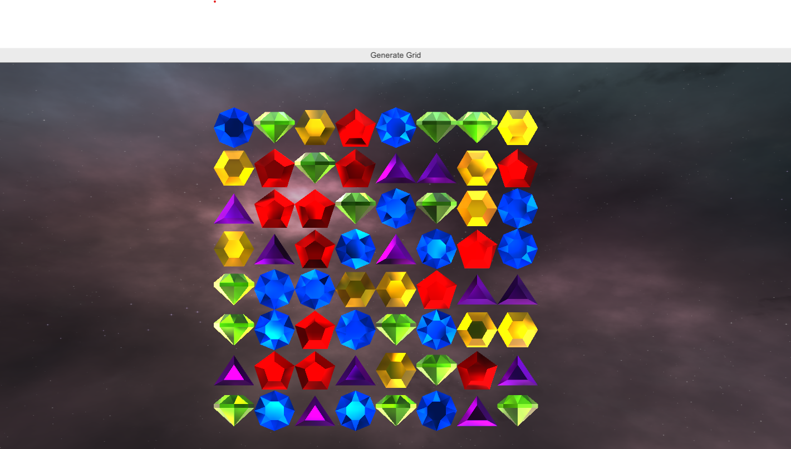

# Bejewelled Clone (not really dont sue me)

Learning repo for making a Bejewelled clone in Unity 3d

## [Read about this repo here](https://mastrowi.cz/not-bejeweled-clone)

## Rules

Three or more gems in a row vertically or horizontally will explode!

Gems can only move in the direction that they have points:

- Blue can move in any direction.
- Green can move Left, Right and Down.
- Yellow can move Left, TopRight, TopLeft, BottomRight and BottomLeft
- Red can move Left, Up, Right, BottomRight and BottomLeft
- Opal/Silver can only move up.

## Todo

- [x] Grid generation
- [x] Gem and camera movement
- [x] Swapping gems
- [x] Unique gem color swapping rules
- [x] Gem death animation
- [ ] Points system / Game rules
- [ ] Main menu scene and interface
- [ ] SFX
- [ ] Music
